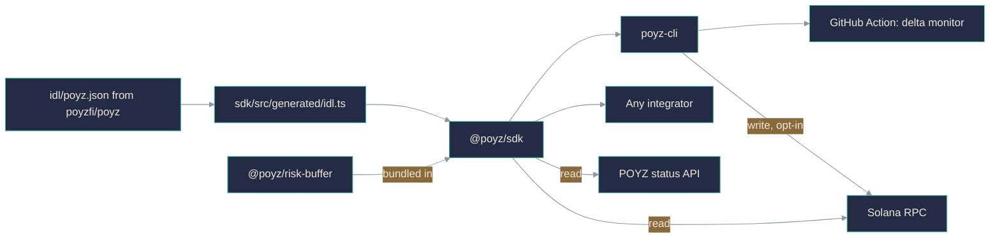

<p align="center">
  
</p>

<p align="center">
  <a href="https://poyz.fi"></a>
  <a href="https://x.com/poyzfi"></a>
  <a href="https://github.com/poyzfi/poyz"></a>
</p>

<p align="center">
  
  
  
  
</p>

<p align="center">
  
  
  
  
</p>

# Poyz tooling

TypeScript packages for [Poyz](https://github.com/poyzfi/poyz), a delta-neutral synthetic
dollar on Solana: read the live book, quote and build mint and redeem transactions, model
the buffer against a negative funding regime, and watch the delta band as a Delta Keeper
would, from a terminal or a CI job.

## Packages

| Package | Name | Purpose |
| --- | --- | --- |
| `packages/sdk` | `@poyz/sdk` | Client library: config, quotes, PDAs, Borsh decoding, instruction builders, read models |
| `packages/cli` | `poyz-cli` | Command line interface over the same builders, plus a GitHub Action |
| `packages/risk-buffer` | `@poyz/risk-buffer` | Buffer accounting, depletion and wipeout scenarios, negative-carry playbook |

`@poyz/sdk` bundles `@poyz/risk-buffer` into its output rather than declaring it as a
runtime dependency, so installing the SDK pulls in one package and not three.

## How the pieces fit



Read paths need no key and can run against either the status API or the chain directly.
Write paths need a wallet, and every write is a dry run until `--execute` is passed.

## Install

Neither package is published to npm yet, so build from source.

```bash
git clone https://github.com/poyzfi/poyz-sdk.git
cd poyz-sdk

npm install
npm run build
npm test

# the CLI, from this checkout
node packages/cli/dist/poyz.mjs --help
```

This repository is an npm workspace. `npm install` at the root links `@poyz/sdk` and
`@poyz/risk-buffer` locally, which is what makes the three packages resolve each other
before any of them exists on a registry.

## Using the SDK

```ts
import {
  assertClientConfig,
  quoteMint,
  annualizeFundingRate,
  buildApiUrl,
  POYZ_API_ROUTES,
  isPresent,
} from "@poyz/sdk";

const config = {
  cluster: "mainnet-beta",
  rpcUrl: "https://api.mainnet-beta.solana.com",
  programId: "Fg6PaFpoGXkYsidMpWTK6W2BeZ7FEfcYkg476zPFsLnS",
  apiBaseUrl: "https://api.poyz.fi",
  commitment: "confirmed",
} as const;

// Rejects an rpcUrl carrying an api key, among other checks. A keyed endpoint
// belongs behind a server route and never in client config.
assertClientConfig(config);

const quote = quoteMint({
  asset,                 // CollateralAsset, including its valuation haircut
  collateralAmount: 250,
  collateralPriceUsd: 172.4,
  mintFeeBps: 10,
});

// Velocity settles funding hourly, so annualise from that interval.
const apy = annualizeFundingRate(0.0009, 1);

const url = buildApiUrl(config.apiBaseUrl, POYZ_API_ROUTES.overview);
const overview = await fetch(url).then((r) => r.json());
```

Collateral is marked at the oracle price, reduced by the asset haircut, then charged the
issuance fee. The haircut exists because a liquid-staking token can trade below its
redemption value, and issuing against a price the protocol cannot exit at builds a
shortfall in on day one.

Every numeric field on the read models is nullable on purpose. When the API cannot produce
a real value the field is `null`, and the consumer is expected to hide that indicator
rather than render a zero. Gate on `isPresent`, not on a falsy check, so a genuine `0`
still displays.

## Using the CLI

```bash
poyz status                  # delta, collateral, funding and protocol config on one screen
poyz delta                   # deviation between the spot leg and the perp short, per venue
poyz funding                 # net carry on the book, signed, funding and cost legs apart
poyz venue list              # hedge venue slots, which are enabled, how fresh each reading is
poyz simulate                # project funding over a horizon, negative regime included

poyz mint                    # submit a mint request against SOL or LST collateral
poyz mint cancel             # reclaim the collateral behind an expired mint request
poyz redeem                  # submit a redeem request against synthetic dollars
poyz redeem cancel           # unwind an expired redeem request

poyz stake                   # take the funding exposure on synthetic dollars
poyz unstake                 # start the unstake cooldown
poyz unstake withdraw        # withdraw a pending unstake once the cooldown has elapsed
poyz claim                   # claim funding accrued to a stake position

poyz keeper register         # register as a Delta Keeper and post the initial bond
poyz keeper bond             # add to an existing keeper bond
poyz keeper unbond           # withdraw from a keeper bond after the cooldown
poyz keeper run              # watch the delta band as a Delta Keeper would
poyz keeper report-venue     # report a venue's net carry and capacity
```

`keeper report-venue` is callable by a bonded keeper as well as by the protocol authority.
The program checks the bond is active and above `min_keeper_bond` before accepting a
reading, and caps the reported capacity at `max_reportable_capacity_notional`, so a keeper
cannot inflate headroom past the ceiling the authority set.

Every write is a dry run unless `--execute` is passed, and `--json` turns any command into
one JSON object on stdout. Reads can be pointed at the API or at the chain with
`--source api|chain|auto`.

## Delta monitoring in CI

`packages/cli/action` is a GitHub Action that fails a workflow when the spot leg and the
perp short have drifted outside the band. `packages/cli/action/example-workflow.yml` is a
complete example.

```yaml
- uses: poyzfi/poyz-sdk/packages/cli/action@main
  with:
    max-deviation-bps: 100
```

Because `poyz-cli` is not on npm yet, the action defaults to building the CLI from the
checked-out repository rather than installing a published version.

## Risk

The yield behind these numbers is perpetual funding, a market rate that goes negative. When
it does, the short pays instead of being paid. `@poyz/risk-buffer` exists to model that
case rather than to look past it: depletion, wipeout, and the negative-carry playbook are
each their own module with their own tests.

The yield is variable, it can be negative, and it is neither promised nor insured. Figures
returned by the status API carry an `is_estimate` flag, and the SDK surfaces it rather than
smoothing it away. Full failure-mode analysis is in the protocol repository under
[docs/risk-spec.md](https://github.com/poyzfi/poyz/blob/main/docs/risk-spec.md).

## Contributing

See [CONTRIBUTING.md](CONTRIBUTING.md). Commit messages are plain sentences; colon prefixes
such as `feat:` are rejected by CI.

```bash
./scripts/check-commit-messages.sh --message "your subject line here"
```

## References

- [Poyz protocol repository](https://github.com/poyzfi/poyz)
- [Velocity funding rates](https://docs.velocity.exchange/trading/funding-rates)
- [Solana web3.js](https://solana-labs.github.io/solana-web3.js/)
- [Pyth price feeds](https://docs.pyth.network/price-feeds)

## License

MIT. See [LICENSE](LICENSE).
